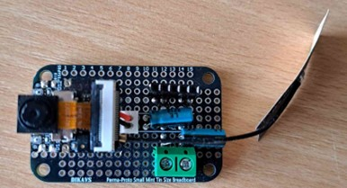

<div align="center">

# ESP32-S3 Low Power Water Meter + On‑Device Vision (Custom YOLO11 trained model) 💧📷 



ESP32-S3 water meter prototype: periodically grabs low‑res frames, runs a quantized on‑device YOLO11 (ESP-DL), serves a SoftAP config page, and publishes JPEG frames plus detection JSON over MQTT.

<sub>Hardware target: ESP32‑S3 (PSRAM) + camera module (OV2640/GC2145 variants).</sub>

</div>

---

> [!WARNING]
> This project is not complete and may have bugs or unfinished features, it's a study project for research purposes only.

## ✨ Features

- 🧠 On‑device inference: Custom YOLO11 (quantized/optimized `.espdl` model) executed via ESP-DL C++ wrapper (`dl_wrapper.cpp`).
- 📸 Periodic camera capture (default QQVGA for speed / RAM) with adjustable interval (NVS‑stored).
- 📡 Dual Wi‑Fi: SoftAP for local config (`WaterMeterEsp32` / `WaterMeterPassword`) + STA auto‑connect to stored network.
- 🌐 Embedded HTTP server (port 80) serving `index.html` from LittleFS and `/config` POST endpoint for provisioning.
- 💾 LittleFS partition for static UI + future logs or cached model updates.
- 🔐 NVS‑backed persistent config: Wi‑Fi SSID/password, MQTT broker URI, capture interval.
- 📬 MQTT publishing: Unique per‑device topic (MAC derived) for JPEG frame + JSON detection payloads.
- 🧱 Modular components: `wifi/`, `mqtt/`, `config/`, `route/`, `dl/`.

# 🗒️Notes

The default Wi-Fi credentials are:

| Define | Value |
|--------|-------|
| AP_DEFAULT_SSID | WaterMeterEsp32 |
| AP_DEFAULT_PASSWORD | WaterMeterPassword |

After connection to the Wi-Fi network, you can access the web UI by navigating to `http://192.168.4.1/` in your browser.

# 🚀 Getting Started

Clone the repository and open it in VSCode with the ESP-IDF extension installed. After this build the project using the ESP-IDF build, flash and monitor task. And voila!

# ⚡Normal behavior

```
I (26) boot: ESP-IDF v5.4.2 2nd stage bootloader
I (26) boot: compile time Aug 26 2025 18:03:05
I (26) boot: Multicore bootloader
I (27) boot: chip revision: v0.2
I (29) boot: efuse block revision: v1.3
I (33) qio_mode: Enabling default flash chip QIO
I (37) boot.esp32s3: Boot SPI Speed : 80MHz
I (41) boot.esp32s3: SPI Mode       : QIO
I (45) boot.esp32s3: SPI Flash Size : 8MB
I (48) boot: Enabling RNG early entropy source...
I (53) boot: Partition Table:
I (56) boot: ## Label            Usage          Type ST Offset   Length
I (62) boot:  0 nvs              WiFi data        01 02 00011000 00006000
I (68) boot:  1 phy_init         RF data          01 01 00017000 00001000
I (75) boot:  2 factory          factory app      00 00 00020000 00500000
I (81) boot:  3 littlefs         Unknown data     01 83 00520000 00080000
I (88) boot: End of partition table
I (91) esp_image: segment 0: paddr=00020020 vaddr=3c170020 size=2dfc1ch (3013660) map
I (548) esp_image: segment 1: paddr=002ffc44 vaddr=3fca1900 size=003d4h (   980) load
I (549) esp_image: segment 2: paddr=00300020 vaddr=42000020 size=1622e4h (1450724) map
I (768) esp_image: segment 3: paddr=0046230c vaddr=3fca1cd4 size=05ff4h ( 24564) load
I (773) esp_image: segment 4: paddr=00468308 vaddr=40374000 size=1d88ch (120972) load
I (797) esp_image: segment 5: paddr=00485b9c vaddr=600fe000 size=0001ch (    28) load
I (808) boot: Loaded app from partition at offset 0x20000
I (809) boot: Disabling RNG early entropy source...
I (819) octal_psram: vendor id    : 0x0d (AP)
I (819) octal_psram: dev id       : 0x02 (generation 3)
I (819) octal_psram: density      : 0x03 (64 Mbit)
I (821) octal_psram: good-die     : 0x01 (Pass)
I (825) octal_psram: Latency      : 0x01 (Fixed)
I (829) octal_psram: VCC          : 0x01 (3V)
I (834) octal_psram: SRF          : 0x01 (Fast Refresh)
I (839) octal_psram: BurstType    : 0x01 (Hybrid Wrap)
I (843) octal_psram: BurstLen     : 0x01 (32 Byte)
I (848) octal_psram: Readlatency  : 0x02 (10 cycles@Fixed)
I (853) octal_psram: DriveStrength: 0x00 (1/1)
I (858) MSPI Timing: PSRAM timing tuning index: 5
I (862) esp_psram: Found 8MB PSRAM device
I (865) esp_psram: Speed: 80MHz
I (868) cpu_start: Multicore app
I (1304) esp_psram: SPI SRAM memory test OK
I (1313) cpu_start: Pro cpu start user code
I (1313) cpu_start: cpu freq: 240000000 Hz
I (1313) app_init: Application information:
I (1313) app_init: Project name:     water_meter_project
I (1318) app_init: App version:      4f680c3
I (1322) app_init: Compile time:     Aug 26 2025 18:34:03
I (1327) app_init: ELF file SHA256:  3775d7ceb...
I (1332) app_init: ESP-IDF:          v5.4.2
I (1335) efuse_init: Min chip rev:     v0.0
I (1339) efuse_init: Max chip rev:     v0.99
I (1343) efuse_init: Chip rev:         v0.2
I (1347) heap_init: Initializing. RAM available for dynamic allocation:
I (1354) heap_init: At 3FCACB40 len 0003CBD0 (242 KiB): RAM
I (1359) heap_init: At 3FCE9710 len 00005724 (21 KiB): RAM
I (1364) heap_init: At 3FCF0000 len 00008000 (32 KiB): DRAM
I (1370) heap_init: At 600FE01C len 00001FCC (7 KiB): RTCRAM
I (1375) esp_psram: Adding pool of 8192K of PSRAM memory to heap allocator
I (1382) spi_flash: detected chip: gd
I (1385) spi_flash: flash io: qio
I (1388) sleep_gpio: Configure to isolate all GPIO pins in sleep state
I (1394) sleep_gpio: Enable automatic switching of GPIO sleep configuration
I (1401) main_task: Started on CPU0
I (1404) esp_psram: Reserving pool of 32K of internal memory for DMA/internal allocations
I (1412) main_task: Calling app_main()
I (1415) main: Starting...
I (1431) main: LittleFS: total=524288, used=16384
I (1432) pp: pp rom version: e7ae62f
I (1432) net80211: net80211 rom version: e7ae62f
I (1434) wifi:wifi driver task: 3fcbece0, prio:23, stack:6656, core=0
I (1444) wifi:wifi firmware version: bea31f3
I (1444) wifi:wifi certification version: v7.0
I (1447) wifi:config NVS flash: enabled
I (1450) wifi:config nano formatting: disabled
I (1454) wifi:Init data frame dynamic rx buffer num: 32
I (1459) wifi:Init static rx mgmt buffer num: 5
I (1463) wifi:Init management short buffer num: 32
I (1468) wifi:Init dynamic tx buffer num: 32
I (1472) wifi:Init static tx FG buffer num: 2
I (1476) wifi:Init static rx buffer size: 1600
I (1480) wifi:Init static rx buffer num: 10
I (1484) wifi:Init dynamic rx buffer num: 32
I (1489) wifi_init: rx ba win: 6
I (1491) wifi_init: accept mbox: 6
I (1494) wifi_init: tcpip mbox: 32
I (1497) wifi_init: udp mbox: 6
I (1500) wifi_init: tcp mbox: 6
I (1503) wifi_init: tcp tx win: 5760
I (1506) wifi_init: tcp rx win: 5760
I (1510) wifi_init: tcp mss: 1440
I (1513) wifi_init: WiFi IRAM OP enabled
I (1516) wifi_init: WiFi RX IRAM OP enabled
I (1526) phy_init: phy_version 701,f4f1da3a,Mar  3 2025,15:50:10
I (1559) wifi:mode : softAP (d8:3b:da:47:1e:2d)
I (1561) wifi:Total power save buffer number: 16
I (1562) wifi:Init max length of beacon: 752/752
I (1562) wifi:Init max length of beacon: 752/752
I (1566) wifi/ap: Wi-Fi AP started. SSID: WaterMeterEsp32
I (1566) esp_netif_lwip: DHCP server started on interface WIFI_AP_DEF with IP: 192.168.4.1
I (1580) wifi:Set ps type: 0, coexist: 0

I (1583) wifi:mode : sta (d8:3b:da:47:1e:2c)
I (1586) wifi:enable tsf
I (1589) wifi/sta: Handling Wi-Fi event, event code 0xd
I (1593) wifi/sta: Wi-Fi event not handled
I (1598) wifi:mode : sta (d8:3b:da:47:1e:2c) + softAP (d8:3b:da:47:1e:2d)
I (1606) wifi:Total power save buffer number: 16
I (1608) wifi:Init max length of beacon: 752/752
I (1613) wifi:Init max length of beacon: 752/752
I (1617) wifi/sta: Handling Wi-Fi event, event code 0x2
I (1622) wifi/sta: Wi-Fi started, connecting to AP...
I (1628) esp_netif_lwip: DHCP server started on interface WIFI_AP_DEF with IP: 192.168.4.1
I (1633) wifi:new:<1,1>, old:<1,1>, ap:<1,1>, sta:<1,0>, prof:1, snd_ch_cfg:0x0
I (1642) wifi:state: init -> auth (0xb0)
I (1648) wifi/sta: Handling Wi-Fi event, event code 0xc
I (1659) wifi/sta: Wi-Fi event not handled
I (2123) wifi:state: auth -> assoc (0x0)
I (2136) wifi:state: assoc -> run (0x10)
I (2159) wifi:connected with Test, aid = 1, channel 1, BW20, bssid = d6:f3:11:2e:36:cd
I (2159) wifi:security: WPA3-SAE, phy: bgn, rssi: -42
I (2160) wifi:pm start, type: 0

I (2163) wifi:dp: 1, bi: 102400, li: 3, scale listen interval from 307200 us to 307200 us
I (2171) wifi:set rx beacon pti, rx_bcn_pti: 0, bcn_timeout: 25000, mt_pti: 0, mt_time: 10000
I (2180) wifi:<ba-add>idx:0 (ifx:0, d6:f3:11:2e:36:cd), tid:0, ssn:0, winSize:64
I (2187) wifi/sta: Handling Wi-Fi event, event code 0x4
I (2192) wifi/sta: Wi-Fi connected
I (2196) wifi:dp: 2, bi: 102400, li: 4, scale listen interval from 307200 us to 409600 us
I (2203) wifi:AP's beacon interval = 102400 us, DTIM period = 2
I (3217) esp_netif_handlers: sta ip: 10.171.206.126, mask: 255.255.255.0, gw: 10.171.206.124
I (3217) wifi/sta: Handling IP event, event code 0x0
I (3219) wifi/sta: Got IP: 10.171.206.126
I (3222) wifi/sta: Connected to STA Wi-Fi network: Test
I (3227) mqtt: Starting MQTT client...
I (3231) mqtt: Using MQTT topic: device-d8:3b:da:47:1e:2c
I (3237) mqtt: Other MQTT event id:7
I (3240) main: Camera detect task starting
I (3243) s3 ll_cam: DMA Channel=1
I (3246) cam_hal: cam init ok
I (3249) sccb-ng: pin_sda 40 pin_scl 39
I (3252) sccb-ng: sccb_i2c_port=1
I (3256) main: Starting HTTP server on port 80
I (3261) main: HTTP server started
I (3263) main_task: Returned from app_main()
I (3266) camera: Detected camera at address=0x30
I (3273) camera: Detected OV2640 camera
I (3275) camera: Camera PID=0x26 VER=0x42 MIDL=0x7f MIDH=0xa2
I (3352) cam_hal: buffer_size: 16384, half_buffer_size: 1024, node_buffer_size: 1024, node_cnt: 16, total_cnt: 3
I (3353) cam_hal: Allocating 3840 Byte frame buffer in PSRAM
I (3357) cam_hal: Allocating 3840 Byte frame buffer in PSRAM
I (3362) cam_hal: cam config ok
I (3365) ov2640: Set PLL: clk_2x: 0, clk_div: 0, pclk_auto: 0, pclk_div: 8
I (3909) dl_wrapper: Decoding JPEG, pointer: 0x3c451110 of size: 1557
I (4100) dl_wrapper: Copied model to 16-byte aligned buffer (0x3c18f20c -> 0x3c461100, size=2821984)
W (4101) FbsLoader: There is only one model in the flatbuffers, ignore the input model name!
W (4106) FbsLoader: CONFIG_SPIRAM_RODATA or CONFIG_SPIRAM_XIP_FROM_PSRAM option is on, fbs model is copyed to PSRAM.
W (4542) dl::Model: Minimize() will delete variables not used in model inference, which will make it impossible to test or debug the model.
I (4547) dl_wrapper: Running detection...
I (6607) mqtt: MQTT_EVENT_CONNECTED
I (33617) main: Detection done: 0 objects in 29708.26 ms
I (33620) main: MQTT published frame len=1557 msg_id=0
I (33621) main: MQTT published empty detections msg_id=0
I (33622) main: Next capture in 60 s
```